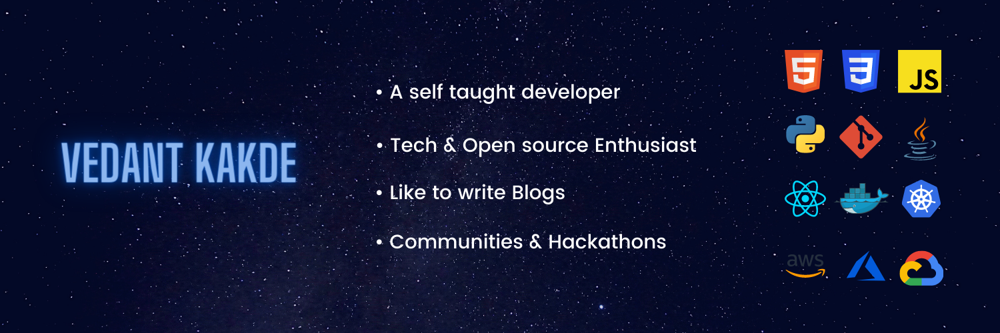

<h1 align="center"> Hey there  I'm Vedant</h1>

## 👨‍💻 About Me
|
My name is <b>Vedant Kakde</b> and I am a junior pursuing my Bachelor's in Computer Engineering from India. 🎓 I am a <b>Web development, DevOps & Cloud enthusiast</b>. Passionate about <b>Open Source</b>  💻 Believe in <b>Learning & Empowering Others</b>
| |
| ------- | -------- |

#### What I am currently doing :
- [Cloud Native Foundations Scholarship Recipient](https://www.udacity.com/scholarships/suse-cloud-native-foundations-scholarship) - Learning to apply modern cloud native application development and DevOps principles.
- [AWS Machine Learning Scholarship Recipient](https://www.udacity.com/scholarships/aws-machine-learning-scholarship-program) - Learning to apply machine learning techniques and algorithms, including deployment to the AWS production environment.
- [Google Cloud Career Readiness Student](https://cloud.google.com/edu/career-readiness) - Preparing for Google Cloud Associate Cloud Engineer certification.
- Learning Web Development, DevOps & Cloud.
- Documenting my journey as part of #100DaysofCode & #100DaysOfCloud Challenge [here](https://www.instagram.com/vedantkakde.tech/).

## 👩🏼‍🤝‍🧑🏻 Socials

<h1 align = "center">
  
    
</h1>

## 🛠 Languages & Tools 

<h1 align = "center">

</h1>

## 📕 Blog Posts
- [What is Kubernetes & It's industry usecases ?](https://www.linkedin.com/pulse/what-kubernetes-its-industry-use-cases-vedant-kakde/)
- [What is Ansible and it's Industry Use cases ?](https://www.linkedin.com/pulse/ansible-its-industry-use-cases-vedant-kakde/)
- [Cloud Computing, AWS and Ubisoft Case Study](https://www.linkedin.com/pulse/cloud-computing-aws-ubisoft-case-study-vedant-kakde/)
- [What is Machine Learning(ML), Artificial Intelligence(AI) & Deep Learning(DL)? And what are it's Use cases?](https://www.linkedin.com/pulse/what-machine-learningml-artificial-intelligenceai-deep-vedant-kakde/)
- [Introduction to Big Data and Hadoop](https://www.linkedin.com/pulse/big-data-vedant-kakde/)

## 📈 GitHub Stats

 

 

