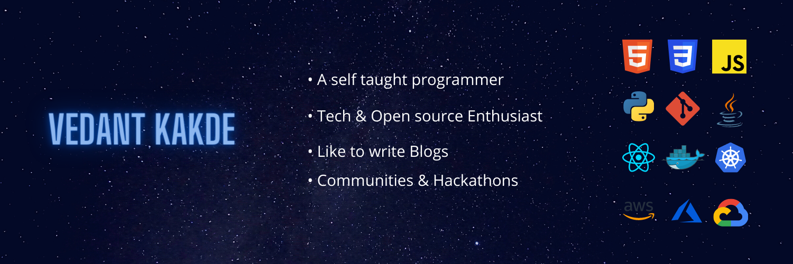

<h1 align="center"> Hello there </h1>

## 👨‍💻 About Me
My name is **Vedant Kakde** and I am a junior pursuing my Bachelor's in Computer Engineering from India. 🎓 &nbsp; I am a **Web development, DevOps & Cloud enthusiast** . &nbsp; Passionate about **Open Source** 💻 &nbsp; Believe in **Learning & Empowering Others**

## 👨🏼‍🤝‍👨🏼 Socials

<h1 align = "center">
  
    
</h1>
  
## 🛠 Languages & Tools 
